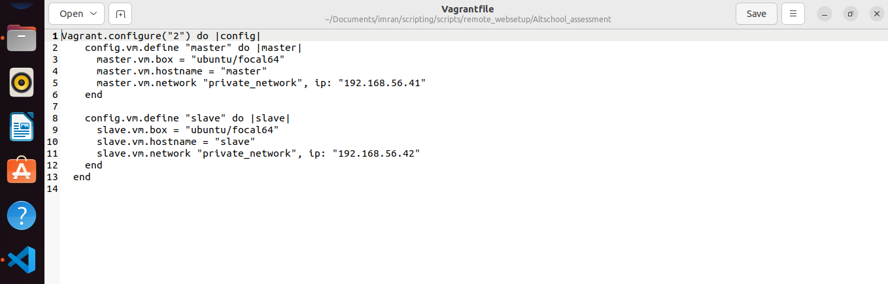
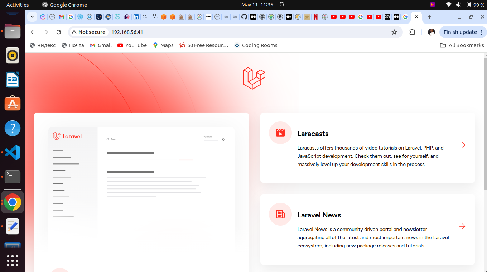
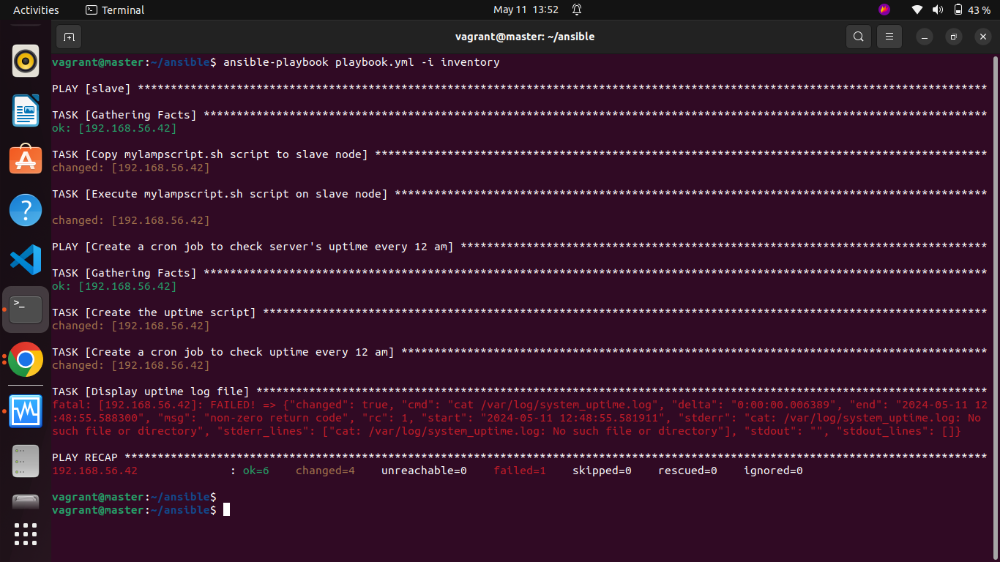
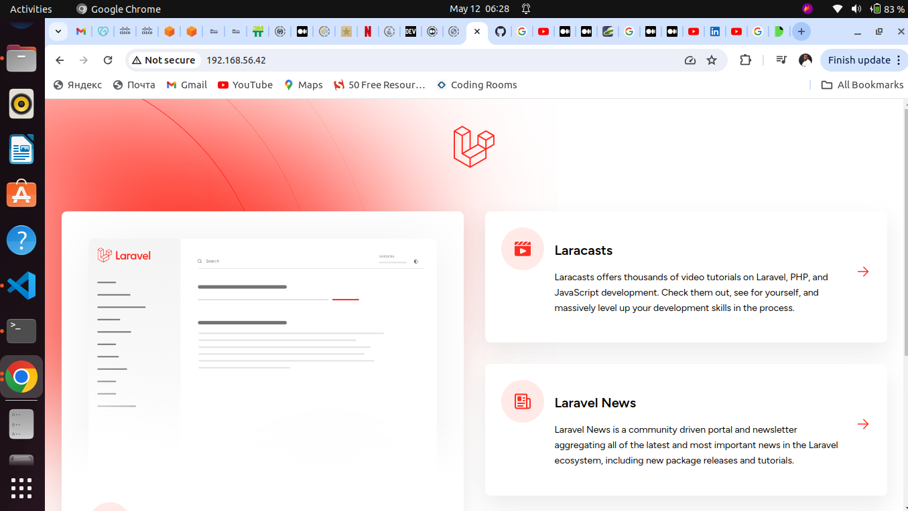

# 3MTT Cloud Engineering – Beginner Module Assessment
## Automating the provisioning of two Ubuntu-based servers, named “Master” and “Slave”, using Vagrant.
## Below is the documentation of steps for the project 
### 1. I created two Ubuntu based servers one Master and one slave
```
Vagrant.configure("2") do |config|
    config.vm.define "master" do |master|
      master.vm.box = "ubuntu/focal64"
      master.vm.hostname = "master"
      master.vm.network "private_network", ip: "192.168.56.41"
    end
  
    config.vm.define "slave" do |slave|
      slave.vm.box = "ubuntu/focal64"
      slave.vm.hostname = "slave"
      slave.vm.network "private_network", ip: "192.168.56.42"
    end
  end
  ``` 
## Screenshot of my Vagrantfile

### I was able to generate ssh-keygen for both servers and copy the master server public key to the authorized keys of the slave server enabling me to log in without asking for password from the master server.
### 2. I created a bash script named mylampscript.sh to automate the deployment of a LAMP on my slave server.
```
#!/bin/bash

# To make the file reusable variables need to be define and the slave machine needs to be specified
GIT_LAMP="/var/www/html/laravel"
GIT_LAMP_PATH="/etc/apache2/sites-available/laravel.conf"
SLAVE_MACHINE="192.168.56.42"

apt --help &> /dev/null

if [ $? -eq 0 ]
then

# Update all packages by running update && update
sudo apt update && apt upgrade -y
echo "*********************************************"
echo "Updating and Upgrading of packages done"
echo "*********************************************"


# Update the PHP repository
sudo add-apt-repository -y ppa:ondrej/php
echo "*********************************************"
echo "Updaing of PHP repository  done"
echo "*********************************************"


#  Apache2 Installation 
sudo apt install -y apache2
sudo systemctl enable apache2
echo "*********************************************"
echo "Installation of Apache2 done"
echo "*********************************************"


# Installing  MySQL server
sudo debconf-set-selections <<< 'mysql-server mysql-server/root_password password'
sudo debconf-set-selections <<< 'mysql-server mysql-server/root_password_again password'
sudo apt install -y mysql-server
echo "*********************************************"
echo "MySQL installation done"
echo "*********************************************"


# Installing  PHP  with its dependecies
sudo apt install -y php libapache2-mod-php php-mysql php8.2 php8.2-curl php8.2-dom php8.2-xml php8.2-mysql php8.2-sqlite3 php8.3 php8.3-curl php8.3-dom php8.3-xml php8.3-mysql php8.3-sqlite3
echo "*********************************************"
echo "Installing PHP with its dependecies"
echo "*********************************************"


# MySQL secure installation 
expect <<EOF
spawn sudo mysql_secure_installation
expect "Would you like to setup VALIDATE PASSWORD component?"
send "y\r"
expect {
    "Please enter 0 = LOW, 1 = MEDIUM and 2 = STRONG" {
        send "1\r"
        exp_continue
    }
    "Remove anonymous users?" {
        send "y\r"
        exp_continue
    }
    "Disallow root login remotely?" {
        send "n\r"
        exp_continue
    }
    "Remove test database and access to it?" {
        send "y\r"
        exp_continue
    }
    "Reload privilege tables now?" {
        send "y\r"
        exp_continue
    }
}
EOF

echo "*********************************************"
echo "MySQL secure installation done"
echo "*********************************************"

# Restart Apache2 service
sudo systemctl restart apache2
echo "*********************************************"
echo "Finished restarting Apache2 service"
echo "*********************************************"


# Installing Git
sudo apt install -y git
echo "*********************************************"
echo "Git installation done"
echo "*********************************************"


# Clone github laravel into my directory which is GIT_LAMP and Cd into the Directory
sudo git clone https://github.com/laravel/laravel $GIT_LAMP
cd $GIT_LAMP
echo "*********************************************"
echo "Cloning of Github laravel done navigating into the directory"
echo "*********************************************"


# Installing Composer and upgrading the composer
sudo apt install -y composer
sudo php -r "copy('https://getcomposer.org/installer', 'composer-setup.php');"
sudo php -r "if (hash_file('sha384', 'composer-setup.php') === 'dac665fdc30fdd8ec78b38b9800061b4150413ff2e3b6f88543c636f7cd84f6db9189d43a81e5503cda447da73c7e5b6') { echo 'Installer verified'; } else { echo 'Installer corrupt'; unlink('composer-setup.php'); } echo PHP_EOL;"
sudo php composer-setup.php --install-dir /usr/bin --filename composer
echo "*********************************************"
echo "Installing and Upgrading of composer done"
echo "*********************************************"


# Using Composer to install needed dependencies
yes | sudo composer install
echo "*********************************************"
echo "Composer dependecies installed"
echo "*********************************************"


# Copy Git Laravel configuration file and set permissions
sudo cp .env.example .env
sudo chown www-data:www-data .env
sudo chmod 640 .env
echo "*********************************************"
echo "Github laravel configuration and permissions settings done"
echo "*********************************************"


# Create slave machine in /etc/apache2/sites-available
sudo tee $GIT_LAMP_PATH >/dev/null <<EOF
<VirtualHost *:80>
    ServerName $SLAVE_MACHINE
    ServerAlias *
    DocumentRoot $GIT_LAMP/public

    <Directory $GIT_LAMP>
        AllowOverride All
    </Directory>
</VirtualHost>
EOF
echo "*********************************************"
echo "Creating slave machine in etc/apache2 done"
echo "*********************************************"


# Generate application key
sudo php artisan key:generate
sudo php artisan migrate --force
echo "*********************************************"
echo "application and migrations done"
echo "*********************************************"

# Change ownership 
sudo chown -R www-data:www-data $GIT_LAMP/database/ $GIT_LAMP/storage/logs/ $GIT_LAMP/storage $GIT_LAMP/bootstrap/cache
echo "*********************************************"
echo "Changing of Ownership done"
echo "*********************************************"

# Set file permissions
sudo chmod -R 775 $GIT_LAMP/database/ $GIT_LAMP/storage/logs/ $GIT_LAMP/storage

# Disable default configuration file
sudo a2dissite 000-default.conf

# Enable Laravel configuration file
sudo a2ensite laravel.conf

# Restart Apache
sudo systemctl restart apache2
echo "*********************************************"
echo "Restarting apache2 "
echo "*********************************************"


uptime > /var/log/uptime.log

else

echo "This is not an ubuntu machine please"
fi
```
### I then tested the script on my master machine and view it from my browser using my Master server Ip address.
## Belove is my web browser screenshot.

### 3. Now to run this script on the slave machine I will be using Ansible playbook 
```
---

- hosts: slave
  become: 'yes'
  tasks:
    - name: Copy mylampscript.sh script to slave node
      copy:
        src: /home/vagrant/mylampscript.sh
        dest: /home/vagrant/mylampscript.sh
        mode: 493
    - name: Execute mylampscript.sh script on slave node
      shell: /home/vagrant/mylampscript.sh
- name: Create a cron job to check server's uptime every 12 am
  hosts: slave
  become: 'yes'
  tasks:
    - name: Create the uptime script
      copy:
        content: |

          #!/bin/bash

          # Log the server's uptime to a file
          uptime > /var/log/system_uptime.log
        dest: /usr/local/bin/view_uptime.sh
        mode: '0755'
    - name: Create a cron job to check uptime every 12 am
      cron:
        name: Check uptime every 12 am
        job: /usr/local/bin/view_uptime.sh
        minute: '0'
        hour: '0'
        state: present
    - name: Display uptime log file
      shell: cat /var/log/system_uptime.log
      register: uptime_output
    - name: Display the server's uptime
      debug:
        msg: '{{ uptime_output.stdout }}'
    - name: Fetch PHP application content using curl
      command: 'curl -s http://192.168.56.42'
      register: php_application
      ignore_errors: true
    - name: Display content of PHP application
      debug:
        msg: |-
          PHP Application Content:
          {{ php_application.stdout }}
```
### I configure the inventory file with the slave server ip address then I run the ansible playbook with the following display.

### I opened my browser and type the slave server Ip address and the deployment was successful.
## Screenshot of my web browser

### The code is reusable and readable I also successfully create a cron job to check the uptime every 12 am.

### References

https://medium.com/@melihovv/zero-time-deploy-of-laravel-project-with-ansible-3235816676bb

https://www.cherryservers.com/blog/how-to-install-and-setup-postgresql-server-on-ubuntu-20-04

https://dev.to/sureshramani/how-to-deploy-laravel-project-with-apache-on-ubuntu-36p3

https://docs.ansible.com/

https://practicaldev-herokuapp-com.freetls.fastly.net/clouddiadem/automation-of-lamp-linux-apache-mysql-php-stack-deployment-using-a-bash-script-in-ansible-2bd8   By Adaeze Nnamdi Udekwe


